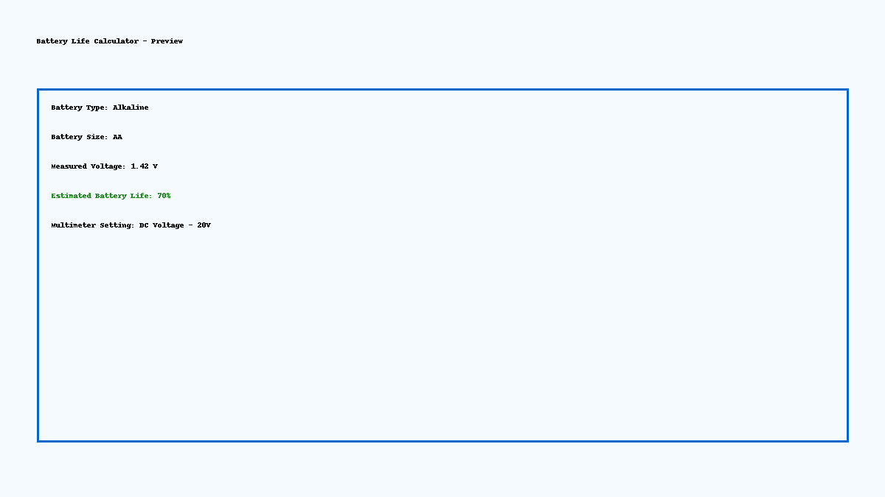

# 🔋 Battery Life Calculator

**Version 1.0 – Offline-Ready HTML Tool**

This lightweight tool estimates battery health and life based on measured voltage, battery type, and size. Designed to work 100% offline and mobile-friendly for field testing using devices like the Greenlee DM-20 multimeter.

---

## 🚀 Features

- 🔽 Dropdowns for **Battery Type**: Alkaline, NiMH
- 🔽 Battery Sizes: AA, AAA, 9V, CR2032
- 📉 Enter measured voltage → get instant **battery life %**
- 📊 Visual battery fill graphic (green/yellow/red)
- ⚡ Auto-fills **recommended multimeter dial setting**
- 🌗 Light/Dark mode toggle (coming in v2)

---

## 🧪 Example

**Measured Voltage:** 1.42V  
**Battery Type:** Alkaline (AA)  
**Output:**  
- Battery Life Estimate: 70%  
- Multimeter Setting: DC Voltage – 20V

---

## 🔐 Privacy & Portability

- Fully offline, no data is stored or sent
- Use in-browser on mobile or desktop
- Easily deployable via GitHub Pages or local file

---

## ✅ Next Versions Will Include:
- CSV logging for test sessions
- Dark mode toggle
- QR code integration
- Battery runtime estimator by capacity/load (already planned)

---

## 🛠 Credits

Built by Robiik7  
Crafted with ❤️ by Katya
