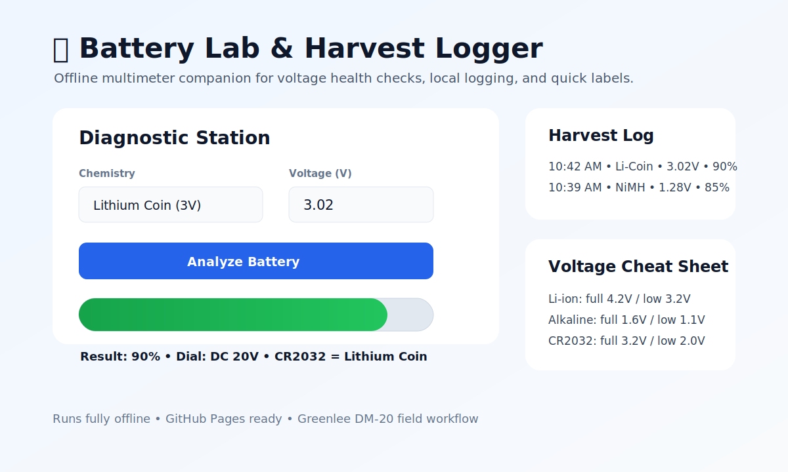

# 🔋 Battery Lab & Harvest Logger

**Current release:** Version 2.x — Offline Battery Diagnostic Station  
**Live app:** https://robiik7.github.io/battery-calculator/  
**Repo:** https://github.com/robiik7/battery-calculator

A lightweight, mobile-friendly battery testing tool for quick field checks with a multimeter such as the **Greenlee DM-20**. The app estimates battery life from voltage readings, gives a color-coded battery fill result, stores recent tests locally in the browser, and includes a voltage cheat sheet for common chemistry profiles.

---

## 🔗 README Quick Links

- [Version 1 Overview](#version-1-overview)
- [Version 2 Current Release](#version-2-current-release)
- [How to Use the Tool](#how-to-use-the-tool)
- [Supported Battery Chemistry Profiles](#supported-battery-chemistry-profiles)
- [Greenlee DM-20 Multimeter Notes](#greenlee-dm-20-multimeter-notes)
- [Version 3 Roadmap](#version-3-roadmap)

---

## Version 1 Overview

Version 1 started as a simple offline voltage-to-percentage calculator.

### Included in V1

- Battery chemistry selection for **Alkaline** and **NiMH**
- Basic voltage input field
- Estimated battery life percentage
- Color-coded battery fill indicator
- Basic multimeter dial recommendation
- Offline single-file HTML structure

---

## Version 2 Current Release

Version 2 upgrades the project into a small **Battery Lab & Harvest Logger**.

### Added / Changed in V2

- New diagnostic station layout
- Chemistry profiles for:
  - **Li-ion / 3.7V cells**
  - **Alkaline / 1.5V cells**
  - **NiMH / 1.2V rechargeable cells**
  - **Lithium coin cells / 3V**, including CR2032-style batteries
- Color-coded battery percentage output
- Animated battery fill meter
- Local harvest/test log using browser `localStorage`
- Printable thermal-label style result card
- Cheat sheet showing full/dead reference voltage ranges
- GitHub Pages-ready `index.html` entry point
- Updated README with version anchors and roadmap

---

## How to Use the Tool

1. Open the live app: **https://robiik7.github.io/battery-calculator/**
2. Select the battery chemistry.
3. Set your multimeter to the recommended **DC voltage** range.
4. Touch the red probe to the battery positive terminal and the black probe to the negative terminal.
5. Type the measured voltage into the app.
6. Press **Analyze Battery**.
7. Review the estimated life percentage, battery fill color, and recent log entry.

---

## Supported Battery Chemistry Profiles

| Chemistry | Nominal Voltage | Full Reference | Dead / Low Reference | App Use Case |
|---|---:|---:|---:|---|
| Li-ion | 3.7V | 4.2V | 3.2V | Rechargeable lithium cells / packs |
| Alkaline | 1.5V | 1.6V | 1.1V | AA, AAA, C, D, 9V-style alkaline testing |
| NiMH | 1.2V | 1.4V | 1.0V | Rechargeable AA/AAA-style cells |
| Lithium Coin | 3.0V | 3.2V | 2.0V | CR2032 / CR2025 / CR2035-style coin cells |

### Important CR2032 Note

A **CR2032 is not NiMH or Alkaline**. It is a **3V lithium coin cell**. In the app, test it under the **Lithium Coin / 3V** profile.

---

## Greenlee DM-20 Multimeter Notes

For the small batteries covered in this tool, use **DC Voltage mode**. On the Greenlee DM-20, the practical field setting is typically:

- **DC 20V** for AA / AAA / C / D / CR2032 / CR2025 / CR2035 / 3.7V Li-ion cells
- For a 9V battery, **DC 20V** is also normally appropriate because the expected reading is below 20V

If your multimeter does not have a 20V DC range, use the next DC voltage range above the expected battery voltage.

---

## Accuracy Notes

Voltage-based battery life is an estimate, not a laboratory-grade capacity test. Real runtime depends on battery chemistry, device load/current draw, battery age, internal resistance, temperature, and whether the reading is open-circuit or under load.

---

## Version 3 Roadmap

Planned next upgrades:

- Battery size selector: AA, AAA, C, D, 9V, CR2032, CR2025, CR2035
- Auto-detected chemistry based on selected battery size
- Voltage slider synced with manual input
- Runtime estimator using **capacity (mAh) ÷ load (mA)**
- Dark mode toggle, defaulting to light mode
- Battery Drain Rate Estimation placeholder/module
- CSV export for the harvest/test log
- Cleaner mobile-first UI polish

---

## Privacy & Offline Use

- No server required
- No data is sent externally by the app
- Recent log entries are stored locally in your browser via `localStorage`
- The tool can run from GitHub Pages or as a local offline HTML file

---

## Credits

Built by **Robiik7**  
Crafted with ❤️ by **Katya / ChatGPT**
